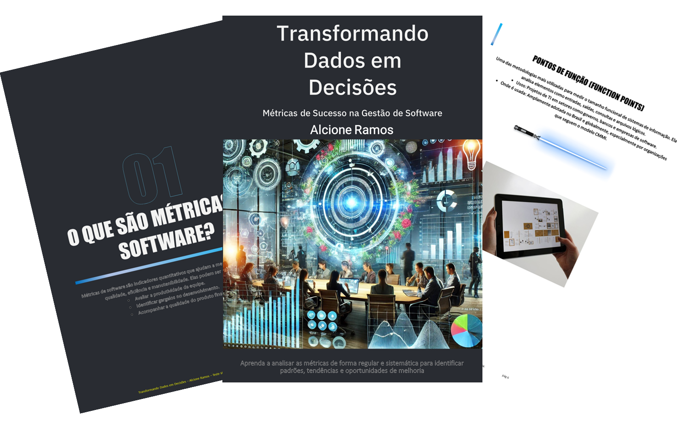

    

-------

# Projeto EBOOK Gerado por I.A.s

 > ℹ️ **NOTE:** Este é o repositório desenvolvido durante o curso de IA na plataforma da [DIO](https://dio.me)

Projeto com o objetivo de gerar um e-book digital com as facilidades das ferramentas de IA. Foram experimentadas diversas plataformas gratuitas, mas a que melhor respondeu os textos foi o chatgpt. Não consegui acessar o MidJourney para imagens. Segue, abaixo, o e-book gerado e um dos prompts usados. Usei, como referência de conteúdo, o Roteiro de Métricas do SISP.

<a href="https://github.com/alcione314/prompts-recipe-to-create-a-ebook/blob/main/Transformando-Dados-em-Decisoes%20vers%C3%A3o%20final.pdf" title="View PDF now"> 📕Clique aqui para ler</a>

## 💻 Tecnologias utilizadas no projeto

- [ChatGPT](https://chat.openai.com/) 
- [PowerPoint](https://www.microsoft.com/en/microsoft-365/powerpoint)

## 🧠 Prompts

ChatGPT：

|   Ação   | prompt                                                                                                                                                                                                                                                                         |
| :------: | ------------------------------------------------------------------------------------------------------------------------------------------------------------------------------------------------------------------------------------------------------------------------------ |
|  título  | Crie um título de e-book sobre o tema Métricas. O tema é do nicho de Gerenciamento e o subnicho de Software. O título deve ser épico e curto e tenha uma temática mais gerencial. Me liste 5 variações de títulos. |
| conteúdo | Faça um texto para e-book com o título “Transformando dados em decisões: Métricas de sucesso na gestão de software”, com foco em medição e análise de software usando como base uma síntese do documento que enviei. {REGRAS} . Explique sempre de uma maneira simples. Deixe o texto enxuto. Sempre traga informações reais. Sempre deixe um título sugestivo por tópico. Estruture em capítulos. |
| capa | Crie uma imagem que retrate o tema "Transforming Data into Decisions: Success Metrics in Software Management"|

## ✨ Features

- Conteúdo e imagens geradas via ChatGPT

## 📚 Materiais

- Imagens utilizadas em `assets`
- ebook gerado durante as aulas em `output`

## 🛠️ Instruções de execução

Utilizei variações dos prompts acima nas ferramentas sugeridas para gerar o material base e utilizei uma ferramenta de edição de documentos como power point para diagramação.

## 👨‍💻 Expert

    
    
&nbsp&nbsp&nbspAlcione Ramos 
    &nbsp&nbsp&nbsp
    <a href="https://github.com/alcione314">
    GitHub</a>&nbsp;|&nbsp;
    <a href="www.linkedin.com/in/alcioneramos">LinkedIn</a>
&nbsp;|&nbsp;
    <a href="https://www.instagram.com/alcionejandircandeas/">
    Instagram</a>
&nbsp;|&nbsp;

  

---

⌨️ com 💜 por [Alcione Ramos](https://github.com/alcione314)
